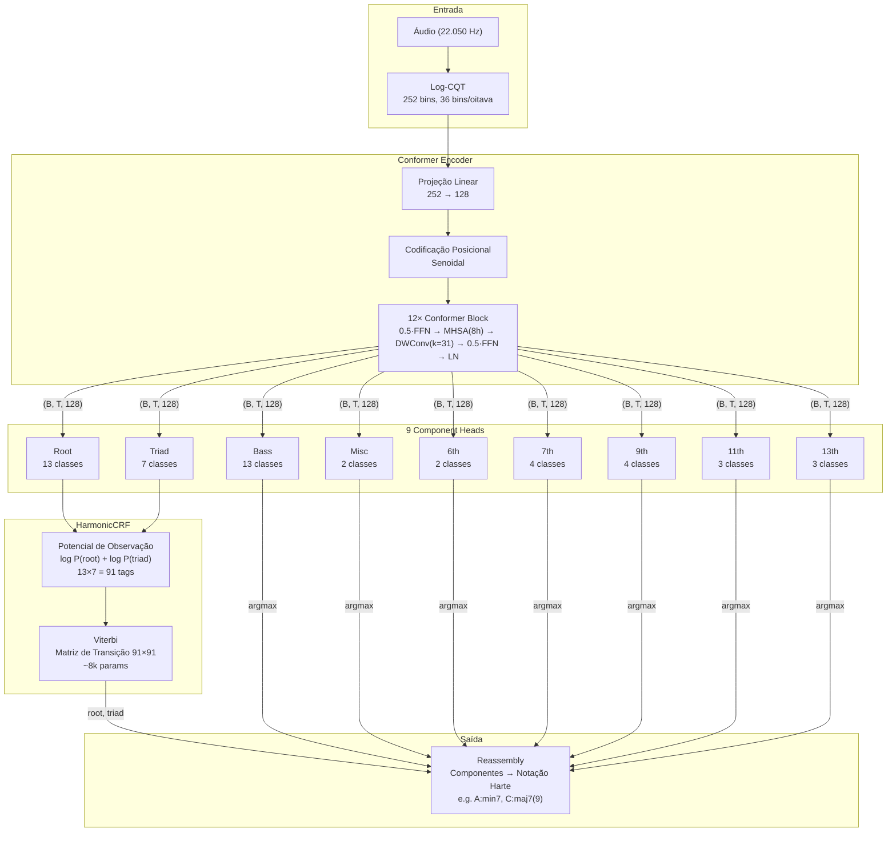
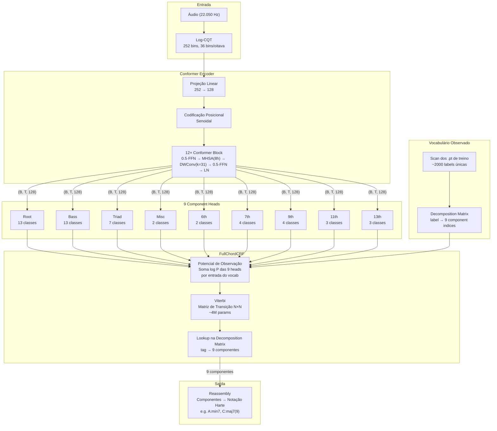

# ChordMax: Descrição da Arquitetura

## Visão Geral

O ChordMax é um sistema de reconhecimento automático de acordes baseado em um encoder Conformer com saída estruturada multi-head que decompõe os rótulos de acordes em nove componentes musicais independentes. Em vez de prever uma única classe a partir de um vocabulário monolítico extenso (e.g., 170 tipos de acordes), o ChordMax fatoriza a predição em sub-tarefas menores e musicalmente significativas, reduzindo o espaço total de saída de 170 para 51 classes distribuídas entre todas as heads, ao mesmo tempo em que amplia a cobertura representacional de tipos complexos de acordes, incluindo harmonias estendidas (9as, 11as, 13as).

O pipeline completo do modelo pode ser descrito da seguinte forma: o sinal de áudio é convertido em um espectrograma Log-CQT com 252 bins de frequência, que alimenta um encoder Conformer de 12 camadas com dimensão oculta de 128. A representação compartilhada produzida pelo encoder é então distribuída a nove heads de classificação paralelas — root (13 classes), bass (13), triad (7), misc (2), 6th (2), 7th (4), 9th (4), 11th (3) e 13th (3) — cada uma responsável por um componente estrutural do acorde. Em seguida, um CRF aplica decodificação de Viterbi com uma matriz de transição aprendida para garantir coerência temporal. Dois modos de CRF estão disponíveis: **root_triad** (91 tags = 13 roots × 7 triads, demais componentes via argmax) e **full** (~2000 tags cobrindo todos os acordes observados no treino, todas as 9 componentes decodificadas conjuntamente). Por fim, os nove componentes preditos são remontados em notação Harte padrão (e.g., A:min7, C:maj7(9)).

## Diagrama da Arquitetura

### Com CRF modo `root_triad` (padrão)

O CRF decodifica conjuntamente root e triad (91 tags). As demais 7 heads são resolvidas por argmax independente.

### Com CRF modo `full`

O CRF decodifica conjuntamente todas as 9 heads sobre o vocabulário completo de acordes observados no treino (~2000 tags).

## Representação de Entrada

A entrada do modelo é um espectrograma Constant-Q Transform (CQT) em escala logarítmica, extraído de áudio amostrado a 22.050 Hz. A CQT é calculada com 252 bins de frequência cobrindo 7 oitavas a uma resolução de 36 bins por oitava, com hop length de 2.048 amostras (~93 ms por frame). A entrada é segmentada em janelas de 108 frames (~10 segundos) para processamento pelo encoder.

## Encoder: Conformer

O encoder de features é uma arquitetura Conformer composta por 12 blocos Conformer empilhados. Cada bloco segue a estrutura Macaron-style:

$$x + 0.5 \cdot \text{FFN}(x) \;\rightarrow\; x + \text{MHSA}(x) \;\rightarrow\; x + \text{Conv}(x) \;\rightarrow\; x + 0.5 \cdot \text{FFN}(x) \;\rightarrow\; \text{LayerNorm}$$

onde MHSA denota multi-head self-attention com 8 heads, Conv denota um módulo de convolução separável em profundidade (depthwise) com kernel de tamanho 31, e FFN denota uma rede feed-forward posicional com fator de expansão 4. A dimensão oculta ao longo de todo o encoder é 128. Uma camada de projeção linear mapeia as features CQT de 252 dimensões para o espaço oculto de 128 dimensões, seguida de codificação posicional senoidal. O dropout de entrada e o dropout por camada são ambos fixados em 0.2.

## Saída: Decomposição Estrutural de Acordes

A saída do encoder, uma representação compartilhada de dimensão (B, T, 128), é passada a nove heads de classificação paralelas, cada uma responsável por um componente estrutural do rótulo do acorde:

| Componente | Classes | Descrição |
|------------|---------|-----------|
| Root       | 13      | Classe de altura da nota fundamental (N, C, C#, D, ..., B) |
| Bass       | 13      | Classe de altura da nota do baixo |
| Triad      | 7       | Qualidade da tríade (N, maj, min, dim, aug, sus2, sus4) |
| Misc       | 2       | Indicador de power chord (N, 5) |
| 6th        | 2       | Extensão de sexta (N, 6) |
| 7th        | 4       | Tipo de sétima (N, maj7, dom/min7, dim7) |
| 9th        | 4       | Extensão de nona (N, 9, #9, b9) |
| 11th       | 3       | Extensão de décima primeira (N, 11, #11) |
| 13th       | 3       | Extensão de décima terceira (N, 13, b13) |

Cada head consiste em uma camada de dropout seguida de uma projeção linear da dimensão oculta para o tamanho do vocabulário do componente. O rótulo completo do acorde é reconstruído a partir dos componentes preditos utilizando um algoritmo determinístico de remontagem que mapeia combinações de componentes de volta à notação Harte padrão (e.g., root=A, triad=min, 7th=b7 produz A:min7).

## Pós-processamento: CRF Harmônico

Um decodificador sequencial de segundo estágio é aplicado sobre o encoder congelado para impor coerência temporal nas predições de acordes. Dois modos estão disponíveis, selecionáveis via `--crf_mode`:

### Modo `root_triad` (HarmonicCRF — padrão)

Opera sobre o espaço conjunto root × triad (13 × 7 = 91 tags), combinando as saídas log-softmax das heads de root e triad em um potencial de observação:

$$\phi(t, k) = \log P(\text{root}_r \mid t) + \log P(\text{triad}_q \mid t), \quad k = r \times 7 + q$$

Uma matriz de transição aprendível (~8k parâmetros) captura progressões harmônicas plausíveis, e a decodificação de Viterbi produz sequências de root-triad temporalmente coerentes. Os sete componentes restantes (bass, misc, 6th, 7th, 9th, 11th, 13th) são decodificados independentemente via argmax.

### Modo `full` (FullChordCRF)

Opera sobre o vocabulário completo de acordes observados nos dados de treino (~2000 tags). Todas as 9 heads contribuem para o potencial de observação:

$$\phi(t, j) = \sum_{i=1}^{9} \log P(\text{comp}_i = M_{j,i} \mid t)$$

onde \( M \) é uma matriz de componentes pré-computada que mapeia cada acorde \( j \) do vocabulário às suas 9 classes de componentes. A matriz de transição (~4M parâmetros para 2000 tags) captura progressões entre acordes completos — incluindo extensões (9th, 11th, 13th) e inversões de bass — que não são modeladas no modo `root_triad`.

O vocabulário é construído automaticamente a partir dos `.pt` de treino via `utils/chord_vocab_builder.py`, com validação round-trip de cada entrada. Tanto o vocabulário quanto a decomposition matrix são salvos no checkpoint do CRF para garantir correspondência exata na inferência.

## Variante ChordFormer-like para Benchmarks Comparáveis

Para permitir comparações justas com o paper ChordFormer, o codebase suporta uma configuração alternativa que replica fielmente os hiperparâmetros do ChordFormer (Tabelas 1, 2, 5, 6 de [`chordformer_vs_chordmax_tables.tex`](chordformer_vs_chordmax_tables.tex)) mantendo as 9 heads de saída do ChordMax (Tabela 4 — Root/Bass/Triad/Misc/6th/7th/9th/11th/13th).

As diferenças entre as duas configurações são selecionáveis via YAML + flags CLI, sem alterar o ChordMax padrão:

| Aspecto                  | ChordMax (padrão)           | ChordFormer-like (variante)        |
| ------------------------ | --------------------------- | ---------------------------------- |
| Hop length               | 2 048 (≈93 ms/frame)        | **512** (≈23 ms/frame)             |
| Janela de entrada        | 108 frames (≈10 s)          | **1 000 frames (≈23,2 s)**         |
| Dimensão oculta          | 128                         | **256**                            |
| Blocos Conformer         | 12                          | **4**                              |
| Heads de atenção         | 8                           | **16**                             |
| FFN expansion (`4×`)     | 128 → 512                   | 256 → **1 024**                    |
| Codif. posicional        | Senoidal                    | **Nenhuma**                        |
| BatchNorm na conv        | Sim                         | Sim (igual)                        |
| GradNorm                 | Ligado (α=0,7)              | **Desligado**                      |
| CRF                      | Matriz treinável (Viterbi)  | **Linear, λ=30 (fixo)**            |
| Otimizador               | Adam                        | **AdamW**                          |
| Scheduler                | CosineAnnealingLR           | **ReduceLROnPlateau (÷10, p=5)**   |
| Batch size               | 32                          | **24**                             |
| Parada                   | Após `num_epochs`           | LR ≤ 10⁻⁶ (early-stop por LR)      |

Os arquivos envolvidos são [`run_config_chordformer.yaml`](../run_config_chordformer.yaml) e [`models/linear_crf.py`](../models/linear_crf.py); o pipeline completo (pré-processamento → backbone → CRF) está documentado em [`chordformer_replication.md`](chordformer_replication.md).
